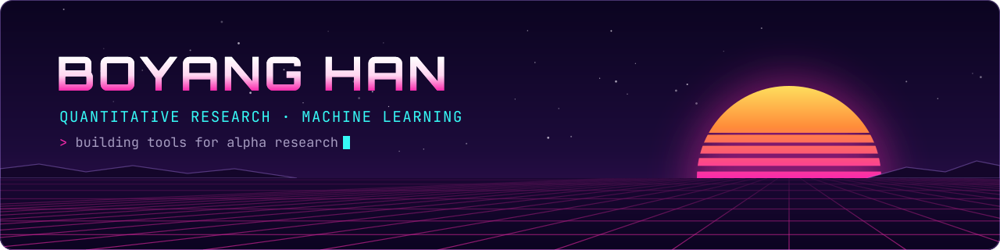
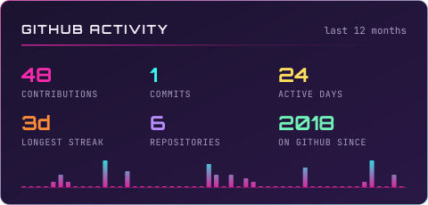
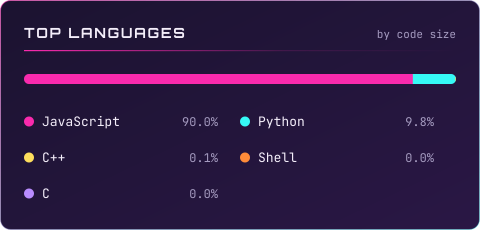

  

  
  
  <!-- Contact badges — uncomment and fill in:
  
  
  -->

### About

I work where quantitative finance meets machine learning: building research infrastructure
that turns raw market data into tested, explainable signals, and the systems that trade on them.

- **Alpha research tooling** — automated factor discovery: symbolic expression search, GPU-accelerated evaluation with PyTorch and Triton, IC-based fitness and genetic evolution.
- **Trading systems** — event-driven execution, market-data pipelines, and backtesting.
- **Deep learning** — experimental network architectures, time-series models, and Kaggle competitions.
- **LLM tooling** — local inference and agent runtimes.

### Toolkit

  
  
  
  
  
  
  
  
  
  

### Activity

  
  

